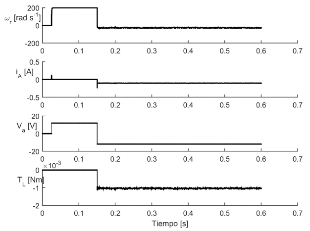
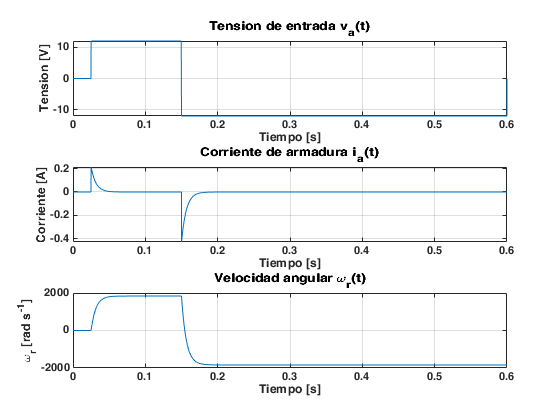
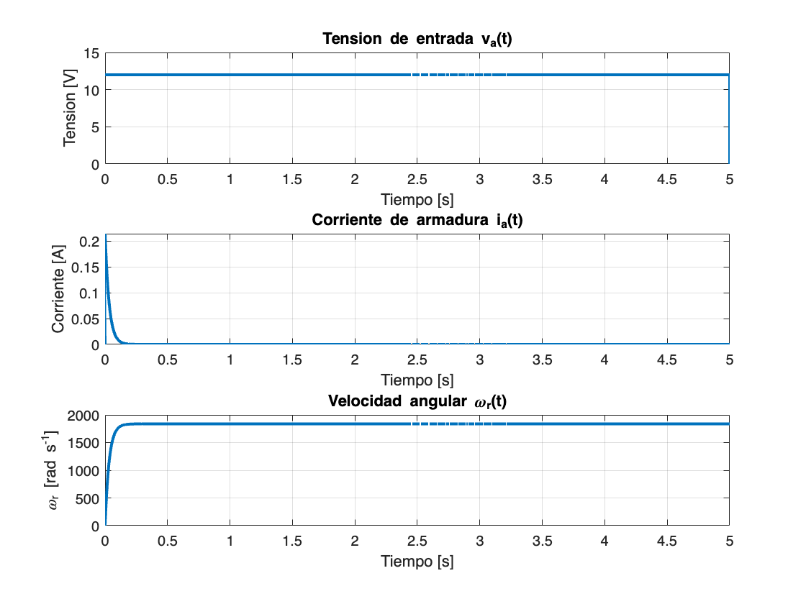
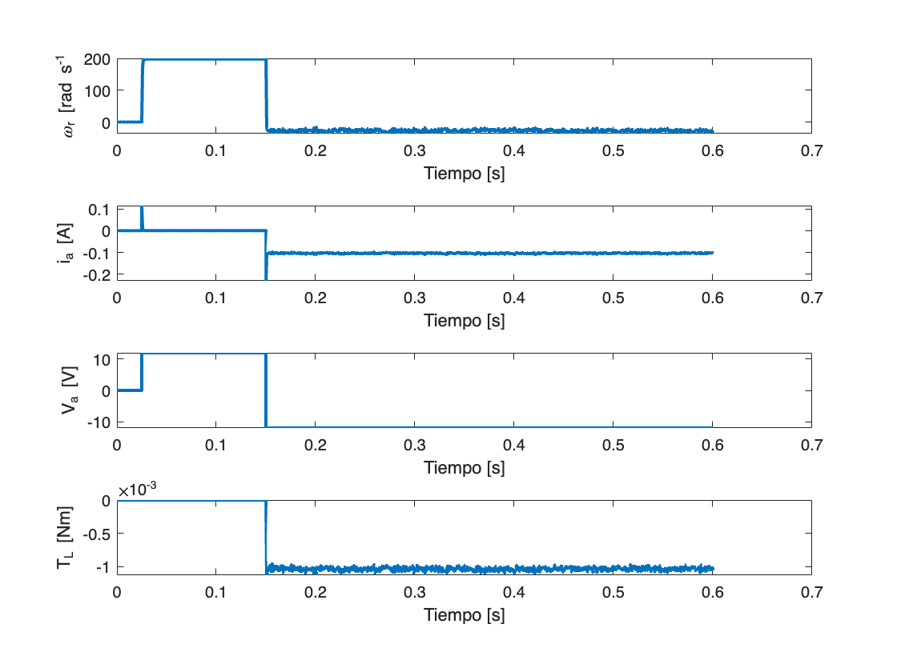
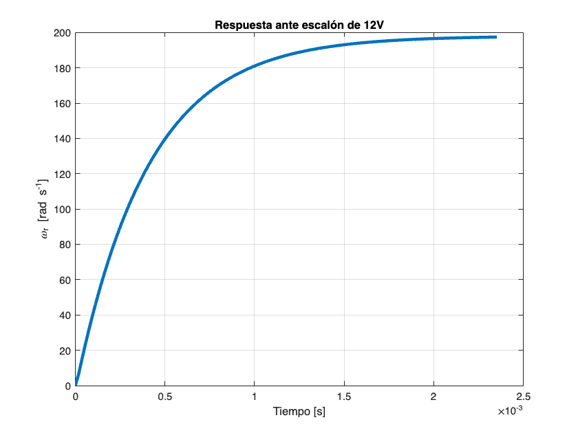

# Actividad Práctica N°1. Representación de sistemas y control PID.
# Caso de estudio 2. Sistema de tres variables de estado.
## Consigna


Dadas las ecuaciones del motor de corriente continua con torque de carga $T_L$ no nulo, con los parámetros:


   -  $L_{AA} = 366 \ 10^{-6} $
   -  $\displaystyle J=5\{10}^{-9}$ 
   -  $\displaystyle R_A =55\ldotp 6$ 
   -  $\displaystyle B_m =0$ 
   - $\displaystyle K_i =6\ldotp 49\{10}^{-3}$ 
   -  $\displaystyle K_m =6\ldotp 53\{10}^{-3}$ 


Modelado por las siguientes ecuaciones diferenciales:


$$
\frac{di_a}{dt} = -\frac{R_A}{L_{AA}}i_a - \frac{K_m}{L_{AA}}\omega _r + \frac{1}{L_{AA}} v_a
$$

$$
\frac{d\omega_r }{dt}=\frac{K_i \}{J}i_a -\frac{B_m \}{J}\omega {\}_r -\frac{1\}{J}T_L
$$

$$
\frac{d\Theta_t }{dt}=\omega_r
$$


Implementar un algoritmo de simulación para inferir el comportamiento de las variables interés  mediante integración Euler con $\Delta t = 10^{-7}$ segundos para:


   1.  Obtener el torque máximo que puede soportar el motor modelado mediante las ecuaciones diferenciales anteriores cuando se lo alimenta con $12V$, graficando para $5$ segundos de tiempo la velocidad angular y la corriente $i_a$. 
   2.  Mostrar simulaciones de 5 segundos que permitan observar la corriente $i_a$ en todo momento y establecer su valor máximo como para dimensionar dispositivos electrónicos. 
   3.  A partir de las curvas de mediciones de las variables graficadas, se requiere obtener el modelo del sistema considerando como entrada un escalón de $12V$, como salida a la velocidad angular, y a partir de $0\ldotp 1$ segundo se aplica un $T_L$ aproximado de $7\ldotp 5\;{10}^{-2} \;\textrm{Nm}$. En el archivo Curvas_Medidas_Motor.xls están las mediciones, en la primer hoja los valores y en la segunda los nombres. Se requiere obtener el modelo dinámico, para establecer las constantes de la corriente. 
   4. Implementar un PID en tiempo discreto para que el ángulo del motor permanezca en una referencia de $1\;\textrm{rad}$. (Tip: a partir de $K_P =0\ldotp 1;K_i =0\ldotp 01;K_D =5$). 





## Resolución


En primera instancia se integran las dos primeras ecuaciones diferenciales haciendo uso del método de Integración de Euler, con el paso fijado en la consigna del ejercicio.


Primero se pasiva la entrada que responde al torque del motor, para integrar las ecuaciones de velocidad angular y corriente en función de la entrada de tensión. Se aplica el teorema de superposición.


```matlab:Code
T = 0.6;
deltaT = 1e-7;
Kmax = T/deltaT;
t = linspace(0,T,Kmax);

Laa = 366e-6;
J = 5e-9;
Ra = 55.6;
Bm = 0;
Ki = 6.49e-3;
Km = 6.53e-3;

Vin = 12;
iaP = 0;
wrP = 0;
Ia = zeros(1, Kmax);
Wr = zeros(1, Kmax);
u = linspace(0, 0, Kmax);
Ia(1) = 0;
Wr(1) = 0;
u(1) = Vin;

A = [-Ra/Laa -Km/Laa; Ki/J -Bm/J];
B = [1/Laa; 0];
C1 = [1 0];
C2 = [0 1];

Ial(1) = 0;
Wrl(1) = 0;
x = [Ia(1) Wr(1)]';
Xop = [0 0]';

ii = 0;
for i = 1:(Kmax-1)
    ii = ii+deltaT;
    if(ii>=0 && ii<0.025)
        Vin = 0;
    end
    if(ii>=0.025 && ii<0.15)
        Vin = 12;
    end
    if(ii>=0.15)
        Vin = -12;
    end
    u(i) = Vin;
    iaP = -(Ra/Laa)*Ia(i)-(Km/Laa)*Wr(i)+(1/Laa)*u(i);
    wrP = (Ki/J)*Ia(i)-(Bm/J)*Wr(i);
    xP = A*(x-Xop)+B*u(i);
    x = x+xP*deltaT;
    Y1 = C1*x;
    Y2 = C2*x;
    Ial(i+1) = x(1);
    Wrl(i+1) = x(2);
end
```


A continuación, se grafican las dos salidas del sistema planteado para una entrada de tensión que inicia en $0V$, luego, al cabo de $0\ldotp 025\;\textrm{seg}$ comienza a valer $12V$, para luego, a los $0\ldotp 125\\textrm{seg}$ cambiar su signo, pasando a valer $-12V$.


```matlab:Code
subplot(3,1,1);
plot(t,u,'LineWidth',3);
title('Tension de entrada v_a(t)');
xlabel('Tiempo [s]');
ylabel('Tension [V]');
grid;
subplot(3,1,2);
plot(t,Ial); 
title('Corriente de armadura i_a(t)');
xlabel('Tiempo [s]');
ylabel('Corriente [A]')
grid;
subplot(3,1,3);
plot(t,Wrl); 
title('Velocidad angular \omega_r(t)');
xlabel('Tiempo [s]');
ylabel('\omega_r [rad s^{-1}]')
grid;
```





Las gráficas anteriores son para simplemente comparar resultados con las gráficas brindadas por la consigna. Ahora, para continuar con lo solicitado, se ingresará el escalón de tensión de $12V$ y se simulará el sistema durante $5\\textrm{seg}$.


```matlab:Code
T = 5;
deltaT = 1e-7;
Kmax = 10000000;
t = linspace(0,T,Kmax);

Laa = 366e-6;
J = 5e-9;
Ra = 55.6;
Bm = 0;
Ki = 6.49e-3;
Km = 6.53e-3;

Vin = 12;
iaP = 0;
wrP = 0;
Ia = zeros(1, Kmax);
Wr = zeros(1, Kmax);
u = linspace(0, 0, Kmax);
Ia(1) = 0;
Wr(1) = 0;
u(1) = Vin;

A = [-Ra/Laa -Km/Laa; Ki/J -Bm/J];
B = [1/Laa; 0];
C1 = [1 0];
C2 = [0 1];

Ial(1) = 0;
Wrl(1) = 0;
x = [Ia(1) Wr(1)]';
Xop = [0 0]';

ii = 0;
for i = 1:(Kmax-1)
    ii = ii+deltaT;
    u(i) = Vin;
    iaP = -(Ra/Laa)*Ia(i)-(Km/Laa)*Wr(i)+(1/Laa)*u(i);
    wrP = (Ki/J)*Ia(i)-(Bm/J)*Wr(i);
    xP = A*(x-Xop)+B*u(i);
    x = x+xP*deltaT;
    Y1 = C1*x;
    Y2 = C2*x;
    Ial(i+1) = x(1);
    Wrl(i+1) = x(2);
end

subplot(3,1,1);
plot(t,u,'LineWidth',2);
title('Tension de entrada v_a(t)');
xlabel('Tiempo [s]');
ylabel('Tension [V]');
grid;
figure(1)
subplot(3,1,2);
plot(t,Ial,'LineWidth',2); 
title('Corriente de armadura i_a(t)');
xlabel('Tiempo [s]');
ylabel('Corriente [A]')
grid;
subplot(3,1,3);
plot(t,Wrl,'LineWidth',2); 
title('Velocidad angular \omega_r(t)');
xlabel('Tiempo [s]');
ylabel('\omega_r [rad s^{-1}]')
grid;
```





El problema pide mostrar simulaciones de $5\\textrm{seg}$ que permitan observar la corriente $i_a$ en todo momento y establecer su valor pico para poder dimensionar dispositivos electrónicos. El gráfico de la corriente puede verse en la figura anterior. A continuación se muestra el pico de esa corriente.


```matlab:Code
disp('El pico de corriente es de:')
```


```text:Output
El pico de corriente es de:
```


```matlab:Code
iMax = max(Ial)
```


```text:Output
iMax = 0.2146
```


Ahora, para obtener el torque máximo que puede soportar el motor cuando se le aplica una entrada de tensión de $12V$, se puede utilizar la ecuación que modela el torque. Es decir:


$$
T=K_i i_a
$$


Siendo que se conoce el máximo de la corriente para la entrada definida, simplemente restaría evaluar la expresión anterior para las condiciones dadas:


```matlab:Code
Tmax = Ki*iMax
```


```text:Output
Tmax = 0.0014
```


Finalmente, el torque máximo que puede soportar el motor para estas condiciones de funcionamiento es de $1\ldotp 4\;{10}^{-3} \;\textrm{Nm}$.


Ahora, para poder implementar el modelado de un sistema MIMO, es decir, múltiples entradas y múltiples salidas, se transforma el sistema de ecuaciones diferenciales al dominio de Laplace, para poder así despejar lo necesario. Se utilizará el paquete simbólico para esta tarea.


$$
{\textrm{sI}}_a \left(s\right)=-\frac{R_A}{L_{\textrm{AA}} }I_a \left(s\right)-\frac{K_m \}{L_{\textrm{AA}} }\Omega_r \left(s\right)+\frac{1\}{L_{\textrm{AA}} }V_a \left(s\right)
$$

$$
s\Omega _r \left(s\right)=\frac{K_i \}{J}I_a \left(s\right)-\frac{B_m \}{J}\Omega {\}_r \left(s\right)-\frac{1\}{J}T_L \left(s\right)
$$

$$
s\Theta _t =\Omega _r \left(s\right)
$$

```matlab:Code
syms s I_a R_A L_AA K_m Omega_r V_a K_i J B_m Theta_t real;
eq1 = s*I_a == -(R_A/L_AA)*I_a-(K_m/L_AA)*Omega_r+(1/L_AA)*V_a
```

eq1 = 

  
$$
 I_a s=\frac{V_a }{L_{\textrm{AA}} }-\frac{K_m \Omega_r }{L_{\textrm{AA}} }-\frac{I_a R_A }{L_{\textrm{AA}} }
$$

```matlab:Code
eq2 = s*Omega_r == (K_i/J)*I_a-(B_m/J)*Omega_r
```

eq2 = 

  
$$
 \Omega_r s=\frac{I_a K_i }{J}-\frac{B_m \Omega_r }{J}
$$


Se obtienen las funciones de transferencia que relacionan la velocidad angular y la corriente con la tensión de entrada, para ello se pasiva la entrada de $T_L$.


```matlab:Code
Omega_r = solve(eq2,Omega_r)
```

Omega_r = 

  
$$
 \frac{I_a K_i }{B_m +Js}
$$

```matlab:Code
eq1 = eval(eq1)
```

eq1 = 

  
$$
 I_a s=\frac{V_a }{L_{\textrm{AA}} }-\frac{I_a R_A }{L_{\textrm{AA}} }-\frac{I_a K_i K_m }{L_{\textrm{AA}} \{\left(B_m +Js\right)}}
$$

```matlab:Code
Ia_Va = collect(simplify(solve(eq1,I_a)/V_a))
```

Ia_Va = 

  
$$
 \frac{Js+B_m }{{\left(JL_{\textrm{AA}} \right)}s^2 +{\left(B_m L_{\textrm{AA}} +JR_A \right)}s+B_m R_A +K_i K_m }
$$

```matlab:Code
syms I_a Omega_r real;
eq1 = s*I_a == -(R_A/L_AA)*I_a-(K_m/L_AA)*Omega_r+(1/L_AA)*V_a;
eq2 = s*Omega_r == (K_i/J)*I_a-(B_m/J)*Omega_r;
I_a = solve(eq2,I_a)
```

I_a = 

  
$$
 \frac{B_m \Omega_r +J \Omega_r s}{K_i }
$$

```matlab:Code
eq1 = collect(eval(eq1))
```

eq1 = 

  
$$
 \frac{J\Omega_r }{K_i }s^2 +\frac{B_m \Omega_r }{K_i }s={\left(-\frac{J\Omega_r R_A }{K_i L_{\textrm{AA}} }\right)}s+\frac{V_a }{L_{\textrm{AA}} }-\frac{K_m \Omega_r }{L_{\textrm{AA}} }-\frac{B_m \Omega_r R_A }{K_i L_{\textrm{AA}} }
$$

```matlab:Code
Omegar_Va = collect(simplify(solve(eq1,Omega_r)/V_a))
```

Omegar_Va = 

  
$$
 \frac{K_i }{{\left(JL_{\textrm{AA}} \right)}s^2 +{\left(B_m L_{\textrm{AA}} +JR_A \right)}s+B_m R_A +K_i K_m }
$$


Siendo que la posición angular es definida como la integral de la velocidad angular, para obtener la función de transferencia de la misma basta simplemente con la aplicación de un integrador a la última función de transferencia obtenida. De esta forma se obtiene:


```matlab:Code
Thetar_Va = collect(simplify(Omegar_Va/s))
```

Thetar_Va = 

  
$$
 \frac{K_i }{{\left(JL_{\textrm{AA}} \right)}s^3 +{\left(B_m L_{\textrm{AA}} +JR_A \right)}s^2 +{\left(B_m R_A +K_i K_m \right)}s}
$$


Ahora, para las funciones de transferencia que involucran al torque de carga como variable de entrada:


```matlab:Code
syms s I_a R_A L_AA K_m Omega_r K_i J B_m T_L Theta_t real;
eq1 = s*I_a == -(R_A/L_AA)*I_a-(K_m/L_AA)*Omega_r
```

eq1 = 

  
$$
 I_a s=-\frac{K_m \Omega_r }{L_{\textrm{AA}} }-\frac{I_a R_A }{L_{\textrm{AA}} }
$$

```matlab:Code
eq2 = s*Omega_r == (K_i/J)*I_a-(B_m/J)*Omega_r-(1/J)*T_L
```

eq2 = 

  
$$
 \Omega_r s=\frac{I_a K_i }{J}-\frac{B_m \Omega_r }{J}-\frac{T_L }{J}
$$

```matlab:Code
Omega_r = solve(eq1,Omega_r);
eq2 = eval(eq2);
I_a = solve(eq2,I_a)
```

I_a = 

  
$$
 \frac{T_L }{J\{\left(\frac{K_i }{J}+\frac{s\{\left(R_A +L_{\textrm{AA}} s\right)}}{K_m }+\frac{B_m \{\left(R_A +L_{\textrm{AA}} s\right)}}{JK_m }\right)}}
$$

```matlab:Code
Ia_TL = collect(simplify(I_a/T_L))
```

Ia_TL = 

  
$$
 \frac{K_m }{{\left(JL_{\textrm{AA}} \right)}s^2 +{\left(B_m L_{\textrm{AA}} +JR_A \right)}s+B_m R_A +K_i K_m }
$$

```matlab:Code
syms I_a Omega_r real;
eq1 = s*I_a == -(R_A/L_AA)*I_a-(K_m/L_AA)*Omega_r;
eq2 = s*Omega_r == (K_i/J)*I_a-(B_m/J)*Omega_r-(1/J)*T_L;
I_a = solve(eq1,I_a);
eq2 = eval(eq2);
Omega_r = solve(eq2,Omega_r);
Omegar_TL = collect(simplify(Omega_r/T_L))
```

Omegar_TL = 

  
$$
 \frac{{\left(-L_{\textrm{AA}} \right)}s-R_A }{{\left(JL_{\textrm{AA}} \right)}s^2 +{\left(B_m L_{\textrm{AA}} +JR_A \right)}s+B_m R_A +K_i K_m }
$$

```matlab:Code
Thetar_TL = collect(simplify(Omegar_TL/s))
```

Thetar_TL = 

  
$$
 \frac{{\left(-L_{\textrm{AA}} \right)}s-R_A }{{\left(JL_{\textrm{AA}} \right)}s^3 +{\left(B_m L_{\textrm{AA}} +JR_A \right)}s^2 +{\left(B_m R_A +K_i K_m \right)}s}
$$


Anteriormente se obtuvieron las diferentes funciones de transferencia del sistema. Con ello, es posible plantear una matriz para un sistema MIMO, en donde cada posición de la misma relacione una entrada con una salida del sistema. Las columnas representan las entradas y las filas las salidas. Se puede resumir entonces el sistema en:


```matlab:Code
[Ia_Va Ia_TL; Omegar_Va Omegar_TL; Thetar_Va Thetar_TL]
```

ans = 

  
$$
 \begin{array}{l}
\left(\begin{array}{cc}
\frac{Js+B_m }{\sigma_1 } & \frac{K_m }{\sigma_1 }\\
\frac{K_i }{\sigma_1 } & \frac{{\left(-L_{\textrm{AA}} \right)}s-R_A }{\sigma_1 }\\
\frac{K_i }{\sigma_2 } & \frac{{\left(-L_{\textrm{AA}} \right)}s-R_A }{\sigma_2 }
\end{array}\right)\\
\mathrm{}\\
\textrm{where}\\
\mathrm{}\\
\sigma_1 ={\left(JL_{\textrm{AA}} \right)}s^2 +{\left(B_m L_{\textrm{AA}} +JR_A \right)}s+B_m R_A +K_i K_m \\
\mathrm{}\\
\sigma_2 ={\left(JL_{\textrm{AA}} \right)}s^3 +{\left(B_m L_{\textrm{AA}} +JR_A \right)}s^2 +{\left(B_m R_A +K_i K_m \right)}s
\end{array}
$$


Es importante notar que las ecuaciones carácterísticas son exactamente iguales para las primeras 4 funciones de transferencia, lo que corrobora el modelado. Y luego, las funciones que relacionan la salida de $\Theta {\}_t$ tienen la misma ecuación característica también, que resulta del producto entre las primeras ecuaciones carácterísticas por la variable de Laplace $s$.


A continuación, se graficarán las mediciones presentes en el archivo de Excel:


```matlab:Code
filename = 'GitHub/TPsControl2/Actividad 1/curvasMotor.xlsx';
sheet = 1;
t = xlsread(filename,sheet,'A1:A31054');
w = xlsread(filename,sheet,'B1:B31054');
i = xlsread(filename,sheet,'C1:C31054');
v = xlsread(filename,sheet,'D1:D31054');
T = xlsread(filename,sheet,'E1:E31054');

subplot(4,1,1);
plot(t,w,'LineWidth',2);
ylabel('\omega_r [rad s^{-1}');
xlabel('Tiempo [s]');
subplot(4,1,2);
plot(t,i,'LineWidth',2);
ylabel('i_a [A]');
xlabel('Tiempo [s]');
subplot(4,1,3);
plot(t,v,'LineWidth',2);
ylabel('V_a [V]');
xlabel('Tiempo [s]');
subplot(4,1,4);
plot(t,T,'LineWidth',2);
ylabel('T_L [Nm]');
xlabel('Tiempo [s]');
```





Para reconocer la función de transferencia junto con sus constantes escalares, se utiliza el método de Chen. Para ello, se define $t_1 =1\ldotp 9\{10}^{-6} \\textrm{seg}$. Se tienen así entonces:


   -  $\displaystyle y\left(t_1 \right)=0\ldotp 13231206$ 
   -  $\displaystyle y\left(2t_1 \right)=0\ldotp 51227978$ 
   -  $\displaystyle y\left(3t_1 \right)=1\ldotp 0610847$ 
   -  $\displaystyle K=198$ 


```matlab:Code
t1 = 1.9e-6;
y1 = 0.13231206;
y2 = 0.51227978;
y3 = 1.0610847;
K = 198;

k1 = (y1/K)-1
```


```text:Output
k1 = -0.9993
```


```matlab:Code
k2 = (y2/K)-1
```


```text:Output
k2 = -0.9974
```


```matlab:Code
k3 = (y3/K)-1
```


```text:Output
k3 = -0.9946
```


```matlab:Code
b = 4*k1^3*k3-3*k1^2*k2^2-4*k2^3+k3^2+6*k1*k2*k3
```


```text:Output
b = 1.4864e-07
```


```matlab:Code
alpha1 = (k1*k2+k3-sqrt(b))/(2*(k1^2+k2))
```


```text:Output
alpha1 = 0.6872
```


```matlab:Code
alpha2 = (k1*k2+k3+sqrt(b))/(2*(k1^2+k2))
```


```text:Output
alpha2 = 0.9953
```


```matlab:Code
beta = (2*k1^3+3*k1*k2+k3-sqrt(b))/sqrt(b)
```


```text:Output
beta = -2.0260
```


```matlab:Code
T1 = -t1/(log(alpha1))
```


```text:Output
T1 = 5.0649e-06
```


```matlab:Code
T2 = -t1/(log(alpha2))
```


```text:Output
T2 = 4.0530e-04
```


```matlab:Code
T3 = beta*(T1-T2)+T1
```


```text:Output
T3 = 8.1595e-04
```


```matlab:Code
s = tf('s');
G = minreal(((K/12))/((T1*s+1)*(T2*s+1)))
```


```text:Output
G =
 
           8.038e09
  ---------------------------
  s^2 + 1.999e05 s + 4.871e08
 
Continuous-time transfer function.
Model Properties
```


```matlab:Code
[u, t] = step(12*G); 
plot(t,u,'LineWidth',3);
title('Respuesta ante escalón de 12V');
xlabel('Tiempo [s]');
ylabel('\omega_r [rad s^{-1}]');
grid;
```





Se puede comprobar mediante la gráfica, que la aproximación a la función de transferencia $G\left(s\right)=\frac{\Omega _r \left(s\right)\}{V_a \left(s\right)}$ es correcta. Ahora, con la definición de la misma se obtienen los parámetros intervinientes. Para que la función de transferencia tenga la forma que tiene la que devuelve Matlab, es necesario expresarla de otra manera, por ello se expresa la ecuación característica como:


$$
D\left(s\right)=s^2 +\frac{R_A }{L_{\textrm{AA}} }s+\frac{K_i K_m }{L_{\textrm{AA}} J}
$$


Como se tienen más incógnitas que ecuaciones, se debe suponer un valor de $L_{\textrm{AA}}$, se utiliza el de la consigna: $L_{\textrm{AA}} =366\mu \\textrm{Hy}$, lo mismo sucede con el valor de $J=5\{10}^{-9} \textrm{Kg}m^2$. Con eso:


$$
R_A =1\ldotp 999\ {10}^5 *366\ {10}^{-6} =73\ldotp 17\\Omega
$$


Luego, generalmente en los motores de corriente continua, las constantes de fuerza electromotriz y de torque poseen valores numéricos muy aproximados (obviando las unidades). Con esto en mente, es posible aproximar $K=K_i =K_m \Rightarrow K_i K_m =K^2$, es decir:


$$
K^2 =4\ldotp 871\ {10}^8\ 366\ {10}^{-6}\ 5\ {10}^{-9} =8\ldotp 91\ {10}^{-4} \Rightarrow K=29\ldotp 8\ {10}^{-3}
$$


Con los valores de las constantes determinados, se debe obtener de forma numérica la función de transferencia de la velocidad angular relacionada al torque. 


$$
\frac{\Omega {\}_r \left(s\right)}{T_L \left(s\right)}=\frac{-366\ {10}^{-6} s-73\ldotp 17}{1\ldotp 83\ {10}^{-12} s^3 +3\ldotp 66\ {10}^{-7} s^2 +8\ldotp 91\ {10}^{-4} s}
$$

```matlab:Code
OmegaT = tf([-366e-6 -73.17], [1.82e-12 3.66e-7 8.91e-4 0])
```


```text:Output
OmegaT =
 
            -0.000366 s - 73.17
  ----------------------------------------
  1.82e-12 s^3 + 3.66e-07 s^2 + 0.000891 s
 
Continuous-time transfer function.
Model Properties
```


Ahora se definen las dos entradas del sistema tal cual son vistas en el documento que almacena los datos de medición, de forma de corroborar que las funciones de transferencia obtenidas sean correctas:


```matlab:Code
T = 0.6;
t = 0:0.0001:T;
t1 = t(t>=0 & t<0.025);
t2 = t(t>=0.025 & t<0.15);
t3 = t(t>=0.15);

v1 = 0*t1;
v2 = 0*t2+12;
v3 = 0*t3-12;
v = [v1 v2 v3];

tl1 = 0*t1;
tl2 = 0*t2;
tl3 = 0*t3-0.00103;
tl =[tl1 tl2 tl3];

Ki = 29.8e-3;
Km = Ki;
Laa = 366e-6;
J = 5e-9;
Ra = 73.17;
Bm = 0;

A = [-Ra/Laa -Km/Laa; Ki/J -Bm/J];
B = [1/Laa; -1/J];
C = [0 1];
D = [1 1];

sys = ss(A,B,C,D)
```


```text:Output
Error using ss
The "B" and "D" matrices must have the same number of columns.
```


```matlab:Code

```

